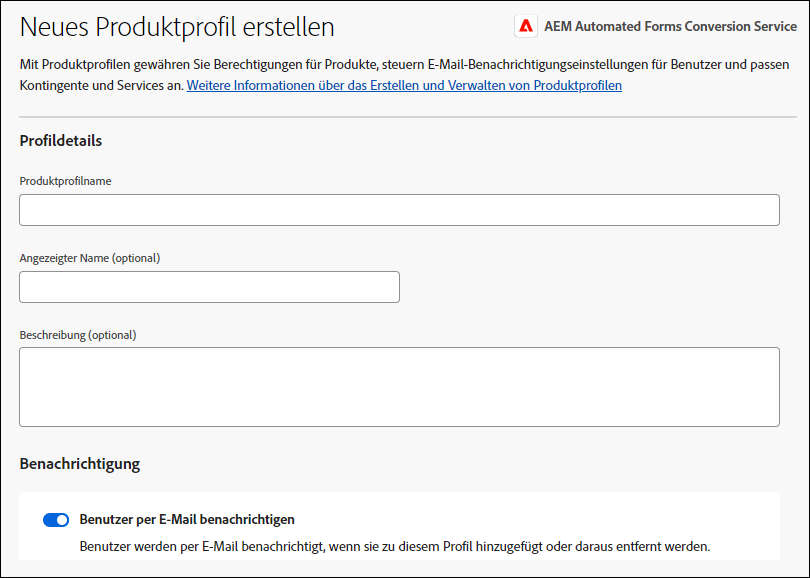
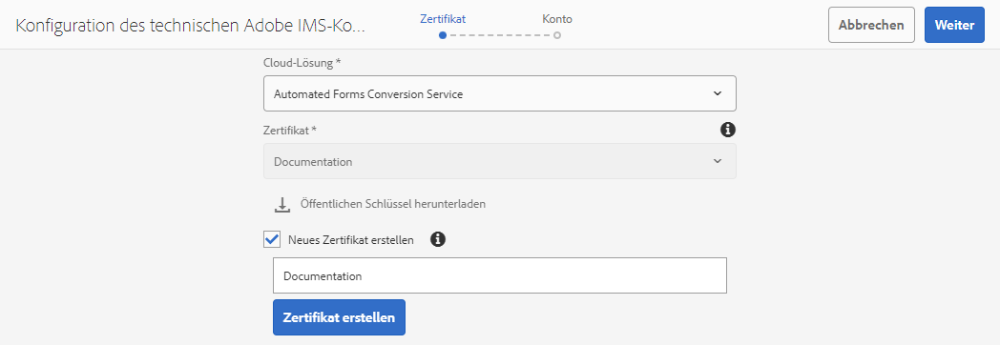

# Konfigurieren des Dienstes für die automatisierte Formularkonvertierung (AFCS) {#about-this-help}

Dieser Artikel beschreibt, wie AEM-Admins den Dienst für die automatisierte Formularkonvertierung (AFCS) konfigurieren können, um die Konvertierung von PDF-Formularen in adaptive Formulare zu automatisieren. Dieser Artikel richtet sich an IT- und AEM-Admins in Ihrem Unternehmen. Personen, die diesen Artikel lesen, sollten mit den folgenden Technologien vertraut sein:

* Installieren, Konfigurieren und Verwalten von Adobe Experience Manager- und AEM-Paketen,

* Verwenden von Linux®- und Microsoft® Windows®-Betriebssystemen,

* SMTP-Mail-Server konfigurieren
=======
<!--- >[!VIDEO](https://video.tv.adobe.com/v/29267/) 

**Watch the video or read the article to configure Automated Forms Conversion service (AFCS)** -->

## Onboarding{#onboarding}

Der Service steht AEM 6.5 Forms- und AEM 6.5 LTS Forms On-Premise-Privatkunden sowie Adobe-Managed Service-Unternehmenskunden kostenlos zur Verfügung. Sie können sich an das Adobe Sales-Team oder Ihren Adobe-Support-Mitarbeiter wenden, um Zugriff auf den Service anzufordern. Der Service ist auch für Kunden von AEM Forms as a Cloud Service kostenlos und verfügbar und vorkonfiguriert.

Adobe ermöglicht den Zugriff für Ihre Organisation und stellt der in Ihrer Organisation als Administrator genannten Person die erforderlichen Berechtigungen zur Verfügung. Der Administrator kann den AEM Forms-Entwicklern (Benutzern) Ihrer Organisation Zugriff gewähren, um eine Verbindung zum Service herzustellen.

## Voraussetzungen {#prerequisites}

Für die Verwendung des Dienstes für die automatisierte Formularkonvertierung (AFCS) ist Folgendes erforderlich:

* Die Aktivierung des Dienstes für die automatisierte Formularkonvertierung (AFCS) für Ihre Organisation
* Ein Adobe ID-Konto mit Administratorrechten für den Konvertierungs-Service
* Eine AEM 6.5-, AEM 6.5 LTS- oder AEM Forms as a Cloud Service-Autoreninstanz mit dem neuesten AEM Service Pack oder den neuesten Aktualisierungen.
* Ein AEM-Benutzer (in Ihrer AEM-Instanz), der Mitglied der Gruppe „forms-user“ ist

## Einrichten der Umgebung {#setuptheservice}

Bereiten Sie vor der Verwendung des Service Ihre AEM-Autoreninstanz für die Verbindung mit dem in Adobe Cloud ausgeführten Service vor. Führen Sie die folgenden Schritte in der angegebenen Reihenfolge aus, um Ihre Instanz für den Service vorzubereiten:


1. [Laden Sie AEM 6.5 oder AEM 6.5 LTS herunter und installieren Sie sie, oder integrieren Sie AEM Forms as a Cloud Service](#aemquickstart)
1. (Nur für AEM 6.5 und AEM 6.5 LTS) [Herunterladen und Installieren des neuesten AEM Service Packs](#servicepack)
1. (Nur für AEM 6.5 und AEM 6.5 LTS) [Laden Sie das neueste Add-On-Paket für AEM Forms herunter und installieren Sie es](#downloadaemformsaddon)
1. (Optional) [Laden Sie das neueste Connector-Paket herunter und installieren Sie es](#installConnectorPackage)
1. [Erstellen benutzerdefinierter Designs und Vorlagen (AEM 6.5 / 6.5 LTS) oder Verwenden von Standardwerten (Cloud Service)](#referencepackage)

### Herunterladen und Installieren von AEM 6.5 oder AEM 6.5 LTS oder Integrieren von AEM Forms as a Cloud Service {#aemquickstart}


Der Dienst für die automatisierte Formularkonvertierung (AFCS) wird in der AEM-Autoreninstanz ausgeführt. Sie benötigen AEM 6.5, AEM 6.5 LTS oder AEM Forms as a Cloud Service, um eine AEM-Autoreninstanz einzurichten.

* Wenn Sie AEM 6.5 oder AEM 6.5 LTS nicht eingerichtet haben und ausführen, laden Sie es von den folgenden Speicherorten herunter. Anweisungen zum Einrichten einer AEM-Autoreninstanz finden Sie nach dem Herunterladen von AEM unter [Bereitstellen und Verwalten](https://helpx.adobe.com/de/experience-manager/6-5/sites/deploying/using/deploy.html#defaultlocalinstall).

   * Wenn Sie bereits AEM-Kunde sind, laden Sie AEM 6.5 oder AEM 6.5 LTS von der [Adobe-Lizenzierungs-Website](http://licensing.adobe.com) herunter.

   * Wenn Sie Adobe-Partner sind, fordern Sie über das [Adobe Partner Training-](https://adobe.allegiancetech.com/cgi-bin/qwebcorporate.dll?idx=82357Q) AEM 6.5 oder AEM 6.5 LTS an.

* Wenn Sie AEM Forms as a Cloud Service verwenden, machen Sie sich mit dem Einstieg in [AEM Forms as a Cloud Service](https://experienceleague.adobe.com/docs/experience-manager-forms-cloud-service/forms/setup-environment/setup-forms-cloud-service.html?lang=de#setup-environment) und dem [Einrichten einer lokalen Entwicklungsumgebung](https://experienceleague.adobe.com/docs/experience-manager-forms-cloud-service/forms/setup-environment/setup-local-development-environment.html?lang=de#setup-environment) vertraut.


### (Nur für AEM 6.5 und AEM 6.5 LTS) Herunterladen und Installieren des neuesten AEM Service Packs {#servicepack}

Laden Sie das aktuelle AEM Service Pack herunter und installieren Sie es. Detaillierte Anweisungen finden Sie in den [Versionshinweisen zu AEM 6.5 Service Pack](https://helpx.adobe.com/de/experience-manager/6-5/release-notes/sp-release-notes.html).

### (Nur für AEM 6.5 und AEM 6.5 LTS) Herunterladen und Installieren des AEM Forms-Add-on-Pakets  {#downloadaemformsaddon}

Eine AEM-Instanz enthält grundlegende Formularfunktionen. Der Konvertierungs-Service erfordert sämtliche Funktionen von AEM Forms. Laden Sie das AEM Forms-Add-On-Paket herunter und installieren Sie es, um alle Funktionen von AEM Forms nutzen zu können. Das Paket ist erforderlich, um den Konvertierungs-Service einzurichten und auszuführen. Detaillierte Anweisungen finden Sie unter [Installieren und Konfigurieren von Datenerfassungsfunktionen](https://experienceleague.adobe.com/de/docs/experience-manager-65/content/forms/install-aem-forms/osgi-installation/installing-configuring-aem-forms-osgi).
>[!NOTE]
> Stellen Sie sicher, dass Sie nach der Installation des Add-On-Pakets die obligatorischen Konfigurationen nach der Installation durchführen.
>

<!-- ### (Optional) Download and install connector package  {#installConnectorPackage}

The connector package provides early access to the [Auto-detect logical sections](convert-existing-forms-to-adaptive-forms.md#run-the-conversion) features and improvements delivered in release AFC-2020.03.1. Do not install the package if you do not require feature and improvements delivered in AFC-2020.03.1.  You can [download the connector package from AEM Package Share](https://www.adobeaemcloud.com/content/marketplace/marketplaceProxy.html?packagePath=/content/companies/public/adobe/packages/cq650/featurepack/AFCS-Connector-2020.03.1). -->


### Erstellen benutzerdefinierter Designs und Vorlagen {#referencepackage}

**AEM Forms as a Cloud Service:** Sie können die vordefinierten Vorlagen verwenden oder benutzerdefinierte Vorlagen erstellen und auf [Service-Konfiguration](#configure-the-cloud-service) verweisen.

**(Nur für AEM 6.5 und AEM 6.5 LTS)** Für den Automated Forms Conversion Service (AFCS) ist mindestens ein Design und eine Vorlage erforderlich, um ein PDF-Formular in ein adaptives Formular zu konvertieren. Sie müssen [Kernkomponenten für adaptive Formulare aktivieren](https://experienceleague.adobe.com/docs/experience-manager-65/forms/adaptive-forms-core-components/enable-adaptive-forms-core-components.html?lang=de) wenn Sie auf Kernkomponenten basierende Vorlagen und Designs verwenden möchten. Anweisungen hierzu finden Sie dort. Wenn Sie AEM 6.5 oder AEM 6.5 LTS im [Produktionsmodus](https://helpx.adobe.com/de/experience-manager/6-5/sites/administering/using/production-ready.html) (Ausführungsmodus „nosamplecontent„) starten, werden die Referenzpakete nicht installiert. Erstellen Sie entweder ein eigenes benutzerdefiniertes Design und eine eigene Vorlage oder laden Sie das [AEM Forms Reference Assets](https://experience.adobe.com/#/downloads/content/software-distribution/de/aemcloud.html)-Paket herunter und installieren Sie es auf Ihrer Autoreninstanz, um Referenz-Designs und Vorlagen zu erhalten. Zeigen Sie dann auf [Dienstkonfiguration](#configure-the-cloud-service), um die Vorlagen und Designs zu verwenden, bevor Sie den Dienst verwenden.

## Konfigurieren von Zugriff und Berechtigungen

Bevor Sie mit der Konfiguration des Dienstes fortfahren und Ihre Instanz mit dem in Adobe Cloud ausgeführten Dienst verbinden, sollten Sie sich über die Personen und Berechtigungen informieren, die für die Verbindung mit dem Dienst erforderlich sind. Der Service verwendet zwei verschiedene Arten von Personen: Administratoren und Entwickler:

* **Administratoren**: Administratoren sind für die Verwaltung der Adobe-Software und -Services für ihre Organisation verantwortlich. Admins gewähren Entwickelnden in ihrer Organisation Zugriff zur Herstellung einer Verbindung zum Dienst für die automatisierte Formularkonvertierung (AFCS), der in Adobe Cloud ausgeführt wird. Wenn Admins für eine Organisation bereitgestellt werden, erhalten diese eine E-Mail mit dem Titel **[!UICONTROL „Sie haben jetzt Administratorrechte zur Verwaltung von Adobe-Software und -Services für Ihre Organisation“]**. Wenn Sie Administrator sind, überprüfen Sie Ihr Postfach auf E-Mails mit dem oben genannten Titel und fahren Sie fort mit dem [Gewähren des Zugriffs für Entwickler Ihrer Organisation](#adduseranddevs).


* **Entwickelnde**: Eine Entwicklerin oder ein Entwickler verbindet eine AEM Forms-Autoreninstanz mit dem Dienst für die automatisierte Formularkonvertierung (AFCS), der in der Adobe Cloud ausgeführt wird. Wenn Admins einer Entwicklerin oder einem Entwickler Rechte zum Herstellen einer Verbindung zum Dienst für die automatisierte Formularkonvertierung (AFCS) gewähren, wird an diese Person eine E-Mail mit dem Titel „Sie haben jetzt Entwicklerzugriff zum Verwalten der Adobe API-Integrationen für Ihr Unternehmen“ gesendet. Wenn Sie Entwickler sind, überprüfen Sie Ihr Postfach auf E-Mails mit dem oben genannten Titel und fahren Sie mit dem [Verbinden Ihrer lokalen AEM-Instanz mit dem Service für die automatisierte Formularkonvertierung in Adobe Cloud](#connectafcadobeio) fort.


### Gewähren von Zugriff für Entwickelnde Ihrer Organisation

Nachdem Adobe den Zugriff für Ihr Unternehmen aktiviert und den Admins die erforderlichen Berechtigungen erteilt hat, können sich diese bei der Admin Console anmelden (detaillierte Anweisungen unten), ein Profil erstellen und Entwickelnde zum Profil hinzufügen. Entwickelnde können eine Instanz von AEM Forms mit dem Dienst für die automatisierte Formularkonvertierung (AFCS) in Adobe Cloud verbinden.

Entwickelende sind Mitglieder Ihrer Organisation, die mit der Ausführung des Konvertierungsdienstes beauftragt sind. Nur Entwickelnde, die dem Profil für den Dienst für die automatisierte Formularkonvertierung (AFCS) von Adobe hinzugefügt wurden, sind berechtigt, den Dienst für die automatisierte Formularkonvertierung (AFCS) zu verwenden.
Führen Sie die folgenden Schritte aus, um ein Profil zu erstellen und ihm Entwickler hinzuzufügen. Es ist mindestens ein Profil erforderlich, um Entwicklern Ihres Unternehmens den erforderlichen Zugriff zu gewähren:

1. Melden Sie sich bei der [Admin Console](https://adminconsole.adobe.com/) an. Melden Sie sich mit der **Adobe ID** des oder der für die Verwendung des Dienstes für die automatisierte Formularkonvertierung (AFCS) bereitgestellten Admins an.
1. Klicken Sie auf die Option **[!UICONTROL Automatisierte Formularkonvertierung]**.
1. Klicken Sie auf **[!UICONTROL Neues Profil]** auf der Registerkarte **[!UICONTROL Produkte]**.
1. Geben Sie **[!UICONTROL Name]**, **[!UICONTROL Anzeigename]** und **[!UICONTROL Beschreibung]** für das Profil an. Klicken Sie auf **[!UICONTROL Fertig]**. Erstellen Sie beispielsweise ein Profil als **AFC_Flamingo_Test_Dev**.

   

1. Fügen Sie Entwickler zum Profil hinzu. Hinzufügen der Entwickler:
   1. In der [Admin Console](https://adminconsole.adobe.com/enterprise), wechseln Sie zur Registerkarte „Übersicht“.
   1. Klicken Sie auf der gewünschten Produktkarte auf **[!UICONTROL Entwickler zuweisen]**.
   1. Geben Sie die E-Mail-Adresse des Entwicklers sowie optional den Vor- und Nachnamen ein.
   1. Wählen Sie „Produktprofile“. Klicken Sie auf **[!UICONTROL Speichern]**.

Wiederholen Sie die obigen Schritte für alle Benutzer. Weitere Informationen zum Hinzufügen von Entwicklern finden Sie unter [Entwickler verwalten](https://helpx.adobe.com/de/enterprise/using/manage-developers.html).

Sobald ein Admin Entwickelnde zum Adobe I/O-Profil hinzufügt, werden die Entwickelnden per E-Mail benachrichtigt (falls konfiguriert).

<!--
### Configure email notification for local AEM Forms instance

Automated Forms Conversion service (AFCS) uses the Day CQ mail service to send email notifications. These email notifications contain information about successful or failed conversions. If you choose not receive notification, skip these steps. Perform the following steps to configure the Day CQ Mail Service:

* For AEM 6.5 Forms or AEM 6.5 LTS Forms:

   1. Go to AEM configuration manager at `http://[server]:[port]/system/console/configMgr`
   2. Open the Day CQ Mail Service configuration. Specify a value for the **[!UICONTROL SMTP server host name]**, **[!UICONTROL SMTP server port]**, and **[!UICONTROL From address]** fields. Click **[!UICONTROL Save]**.

      You can contact your email service provider or IT administrator for information about host name and port of SMTP server. You can use any valid email address in the from field. For example, notification@example.com or donotreply@example.com.

   3. Open the **[!UICONTROL Day CQ Link Externalizer]** configuration. In the **[!UICONTROL Domains]** field, specify the actual host name or IP address and port number for local, author, and publish instances. Click **[!UICONTROL Save]**.

* For AEM Forms as a Cloud Service, [log a support ticket to enable the email service](https://experienceleague.adobe.com/docs/experience-manager-cloud-service/implementing/developing/development-guidelines.html?lang=en#sending-email). -->

### Benutzer zur Gruppe „forms-users“ hinzufügen {#adduserstousergroup}

Geben Sie im Profil des AEM-Benutzers, der den Service ausführen soll, eine E-Mail-Adresse an. Stellen Sie sicher, dass die Benutzerin oder der Benutzer Mitglied der Gruppe **forms-users** ist. E-Mails werden an die E-Mail-Adresse des Benutzers gesendet, der die Konvertierung ausführt. So geben Sie eine E-Mail-Adresse für den Benutzer an und fügen den Benutzer der Formularbenutzergruppe hinzu:

1. Melden Sie sich bei Ihrer AEM Forms-Autoreninstanz als AEM-Administrator an. Verwenden Sie Ihre lokalen AEM-Anmeldeinformationen, um sich anzumelden.
1. Klicken Sie auf **[!UICONTROL Adobe Experience Manager]** > **[!UICONTROL Tools]** > **[!UICONTROL Sicherheit]** > **[!UICONTROL Benutzer]**.
1. Wählen Sie eine Benutzerin oder einen Benutzer aus, die bzw. der den Konvertierungsdienst ausführen soll, und tippen Sie auf **[!UICONTROL Eigenschaften]**. Die Seite **Edit User Settings** (Benutzereinstellungen bearbeiten) wird geöffnet.
1. Geben Sie im Feld **[!UICONTROL E-Mail]** eine E-Mail-Adresse an und klicken Sie auf **[!UICONTROL Speichern]**. Die E-Mails werden nach erfolgreichem Abschluss oder fehlgeschlagener Konvertierung an die angegebene E-Mail-Adresse gesendet.

   
1. Klicken Sie auf die Registerkarte **Gruppen**. Geben Sie auf der Registerkarte „Gruppe auswählen“ die Gruppe **forms-users** ein und wählen Sie sie aus.
1. Klicken Sie auf **Speichern und schließen**. Die Benutzerin bzw. der Benutzer ist jetzt Mitglied der Gruppe der Formularbenutzenden.

#### (Nur für AEM 6.5 und AEM 6.5 LTS) Abrufen öffentlicher Zertifikate {#obtainpubliccertificates}


## Verbinden Ihrer AEM Forms-Instanz mit dem Dienst für die automatisierte Formularkonvertierung (AFCS) in Adobe Cloud

Nachdem Admins Ihnen Entwicklerzugriff gewährt haben, können Sie Ihre AEM Forms-Instanz mit dem in Adobe Cloud ausgeführten Dienst für die automatisierte Formularkonvertierung (AFCS) verbinden.
Führen Sie die folgenden Schritte aus, um Ihre AEM Forms-Instanz dem Dienst für die automatisierte Formularkonvertierung (AFCS) zu verbinden:

[&#x200B;1. Service-APIs in der Adobe Developer Console konfigurieren](#configure-the-service-apis-on-adobe-developer-console)

[&#x200B;2. Adobe IMS-Konfigurationen erstellen](#2-create-adobe-ims-configurations)

[&#x200B;3. Konfiguration für automatisierte Formularkonvertierung erstellen](#3-create-automated-forms-conversion-configuration)

### &#x200B;1. Service-APIs in der Adobe Developer Console konfigurieren

Um den Dienst für die automatisierte Formularkonvertierung (AFCS) zu verwenden, erstellen Sie ein Projekt und fügen Sie dem Projekt in der Adobe Developer Console das API des **Dienstes für die automatisierte Formularkonvertierung** hinzu. Durch die Integration werden ein API-Schlüssel, Client-Geheimnis, die ID des technischen Kontos, Umfang und Organisations-ID.
Gehen Sie wie folgt vor, um das API des Dienstes für die automatisierte Formularkonvertierung in Adobe Developer Console zu konfigurieren:

1. Melden Sie sich bei https://developer.adobe.com/console an . Melden Sie sich mit Ihrer Adobe ID und Ihrem vom Admin zu diesem Zweck bereitgestellten Entwicklerkonto bei der I/O-Konsole an.
1. Wählen Sie Ihr Unternehmen oben rechts aus. Wenn Sie Ihre Organisation nicht kennen, wenden Sie sich an Ihren Admin.
1. Klicken Sie auf **[!UICONTROL Neues Projekt erstellen]**. Ein Bildschirm zum Starten Ihres neuen Projekts wird angezeigt.

   

1. Klicken Sie auf **[!UICONTROL API hinzufügen]**. Ein Bildschirm mit einer Liste aller für Ihr Konto aktivierten APIs wird angezeigt.
   

1. Wählen Sie den **[!UICONTROL Dienst für die automatisierte Formularkonvertierung]** und klicken Sie auf **[!UICONTROL Weiter]**. Ein Bildschirm zum Konfigurieren der API wird angezeigt.
   

1. Wählen Sie die Authentifizierungsmethode **OAuth-Server-zu-Server** aus.
1. Geben Sie den **[!UICONTROL Berechtigungsnamen]** an und klicken Sie auf **[!UICONTROL Weiter]**.
   
1. Wählen Sie ein **Produktprofil** aus. Wählen Sie beispielsweise ein Profil wie **AFC_Flamingo_Test_Dev** aus.
1. Klicken Sie auf **[!UICONTROL Konfigurierte API speichern]**.
   

   >[!NOTE]
   >
   > Wählen Sie das Profil aus, das beim Gewähren des Zugriffs für Entwickelnde in Ihrer Organisation erstellt wurde. Wenn Sie das auszuwählende Profil nicht kennen, wenden Sie sich an Ihren Admin.

1. Klicken Sie auf **[!UICONTROL OAuth Server-zu-Server]**, um den API-Schlüssel, das Client-Geheimnis und andere Informationen anzuzeigen, die erforderlich sind, um Ihre AEM-Instanz mit dem Dienst für die automatisierte Formularkonvertierung (AFCS) zu verbinden.
   

   Die Informationen auf der Seite werden zur Erstellung der IMS-Konfiguration verwendet, wie im Abschnitt [Erstellen einer technischen IMS-Konfiguration in der AEM-Autoreninstanz](#2-create-ims-technical-configuration-on-aem-author-instance) beschrieben.

   

### &#x200B;2. Adobe IMS-Konfigurationen erstellen


Melden Sie sich bei Ihrer Autoreninstanz an, um die Adobe IMS-Konfigurationen zu erstellen. Verwenden Sie die **Details zu OAuth-Anmeldedaten**, um den API-Schlüssel, das Client-Geheimnis, die ID des technischen Kontos, die Umfang und die Organisations-ID abzurufen.

1. Melden Sie sich bei Ihrer AEM Forms-Autoreninstanz an. Navigieren Sie zu **[!UICONTROL Tools]**> **[!UICONTROL Sicherheit]** > **[!UICONTROL Adobe IMS-Konfigurationen]**.
1. Klicken Sie auf **[!UICONTROL Erstellen]**.

   

1. Die Seite **[!UICONTROL Konfiguration des technischen Kontos von Adobe IMS]** wird angezeigt.

   
1. Wählen Sie in der **Cloud-Lösung** den **[!UICONTROL Dienst für die automatisierte Formularkonvertierung]**.
1. Geben Sie Folgendes an:

   * **Titel**: Geben Sie einen Titel an.
   * **Autorisierungsserver**: [https://ims-na1.adobelogin.com](https://ims-na1.adobelogin.com)
   * Rufen Sie Folgendes aus dem Abschnitt [Konfigurieren der Service-APIs für Adobe Developer Console](#1-configure-the-service-apis-on-adobe-developer-console) ab:
      * **Client-ID**: Kopieren Sie den **API-Schlüssel (Client-ID)** und fügen Sie ihn ein.
      * **Client-Geheimnis**: Kopieren Sie das **Client-Geheimnis** und fügen Sie es ein.
      * **Umfang**: Kopieren Sie den **Umfang** und fügen Sie ihn ein.
      * **Organisations-ID**: Kopieren Sie die **ID des technischen Kontos** und fügen Sie sie ein.

     

1. Klicken Sie auf **[!UICONTROL Speichern]**. Die Adobe IMS-Konfiguration wird erstellt.

   >[!CAUTION]
   >
   > Erstellen Sie nur eine IMS-Konfiguration. Erstellen Sie nicht mehr als eine IMS-Konfiguration.

1. Wählen Sie die **Adobe IMS-Konfiguration** aus und klicken Sie auf **[!UICONTROL Konsistenz prüfen]**. Ein Dialogfeld wird angezeigt.
   

   Das Dialogfeld **Prüfen** wird angezeigt.

1. Klicken Sie auf **[!UICONTROL Prüfen]**.

   

   Bei erfolgreicher Verbindung wird die Meldung *Token erfolgreich abgerufen* angezeigt.

   

1. Klicken Sie auf **Schließen**.

### &#x200B;3. Konfiguration für automatisierte Formularkonvertierung erstellen

Erstellen Sie eine Konfiguration für die automatisierte Formularkonvertierung, um Ihre AEM-Instanz mit dem Konvertierungsdienst zu verbinden. Außerdem können Sie eine Vorlage, ein Design und Formularfragmente für eine Konvertierung angeben. Sie können mehrere Cloud-Dienstkonfigurationen für jeden Formularsatz separat erstellen.
Beispielsweise können Sie separate Konfigurationen für Formulare der Verkaufsabteilung und für Formulare für den Kundensupport erstellen. Führen Sie die folgenden Schritte aus, um ein eine Cloud-Service-Konfiguration zu erstellen:

1. Klicken Sie in Ihrer AEM Forms-Instanz auf **[!UICONTROL Adobe Experience Manager]** > **[!UICONTROL Tools]**> **[!UICONTROL Cloud Services]** > **[!UICONTROL Konfiguration für die automatisierte Formularkonvertierung]**.
1. Wählen Sie den Ordner **[!UICONTROL Global]** aus und klicken Sie auf **[!UICONTROL Erstellen]**.
Die Seite zum **Erstellen der Konfiguration für die automatisierte Formularkonvertierung** wird angezeigt. Die Konfiguration wird im Ordner **Global** erstellt. Sie können die Konfiguration auch in einem anderen, bereits vorhandenen Ordner anlegen oder einen Ordner für Ihre Konfigurationen erstellen.
   
1. Geben Sie auf der Seite **[!UICONTROL Erstellen der Konfiguration für die automatisierte Formularkonvertierung]** Werte für die folgenden Felder ein und klicken Sie auf **[!UICONTROL Weiter]**.

   

   | Feld | Beschreibung |
   |--- |--- |
   | Titel | Eindeutiger Titel für die Konfiguration. Der Titel wird in der Benutzeroberfläche zum Starten der Konvertierung angezeigt. |
   | Name | Eindeutiger Name für die Konfiguration. Die Konfiguration wird im CRX-Repository unter dem angegebenen Namen gespeichert. Der Name kann mit dem Titel identisch sein. |
   | Position der Miniaturansicht | Position der Miniaturansicht für die Konfiguration. |
   | Service-URL | URL des Dienstes für die automatisierte Formularkonvertierung (AFCS) in Adobe Cloud. Verwenden Sie die URL `https://aemformsconversion.adobe.io/`. |
   | Vorlage | Standardvorlage für konvertierte Formulare. Sie können jederzeit eine andere Vorlage angeben, bevor Sie mit der Konvertierung beginnen. Eine Vorlage enthält die Grundstruktur und den Anfangsinhalt für ein adaptives Formular. Sie können eine Vorlage aus den standardmäßig bereitgestellten Vorlagen auswählen. Sie können auch eine benutzerdefinierte Vorlage erstellen. |
   | Design | Standarddesign für konvertierte Formulare. Sie können jederzeit ein anderes Design angeben, bevor Sie mit der Konvertierung beginnen.  Sie können auf das Symbol klicken, um ein standardmäßig bereitgestelltes Design auszuwählen. Sie können auch ein benutzerdefiniertes Design erstellen. |
   | Vorhandene Fragmente | Position vorhandener Fragmente, falls vorhanden. |
   | Benutzerdefiniertes Metamodell | Pfad der .schema.json-Datei des benutzerdefinierten Metamodells. Sie können separate Metamodelle für die Sprachen Deutsch, Englisch, Französisch, Italienisch, Portugiesisch und Spanisch erstellen. |

1. Geben Sie auf der Registerkarte **[!UICONTROL Erweitert]** der Seite **[!UICONTROL Konfiguration für die automatisierte Formularkonvertierung erstellen]** Werte für die folgenden Felder ein:
   

   <table>
   <thead>
   <tr>
   <th>Feld</th>
   <th>Beschreibung</th>
   </tr>
   </thead>
   <tbody>
   <tr>
   <td >Generieren des Datensatzdokuments</td>
   <td>Wählen Sie die Option zum automatischen Generieren des Datensatzdokuments für konvertierte Formulare. Die Option gilt nur für XFA-basierte Formulare (XDP- und PDF-Formulare). Wenn Sie diese Option aktivieren, können Sie nach dem Absenden eines Formulars Ihren Kunden die Möglichkeit geben, die von ihnen im Formular ausgefüllten Informationen in gedruckter Form oder als Dokument aufzubewahren, um sie später nachlesen zu können. Dies wird als Datensatzdokument bezeichnet.</td>
   </tr>
   <tr>
   <td>Analytics aktivieren</td>
   <td>(Nur für AEM 6.5 und AEM 6.5 LTS) Wählen Sie die Option aus, um Adobe Analytics für alle konvertierten Formulare zu aktivieren. Stellen Sie vor Verwendung der Option sicher, dass Adobe Analytics für Ihre AEM Forms-Instanz aktiviert ist.</td>
   </tr>
   </tbody>
   </table>

   * Wenn die Quelle ein XFA-basiertes Formular mit der Erweiterung .XDP ist, behält das Ausgabe-DOR das XFA-Layout bei, andernfalls verwendet der Konvertierungs-Service eine standardmäßig bereitgestellte Vorlage, um das DOR für andere XFA-basierte Formulare zu generieren.
   * Wenn ein XFA-Formular gesendet wird, werden die Übermittlungsdaten des Formulars als XML-Element oder Attribut gespeichert. Beispiel: `<Amount currency="USD"> 10.00 </Amount>`. Die Währung wird als Attribut, der Währungsbetrag 10,00 als Element gespeichert. Übermittlungsdaten adaptiver Formulare enthalten keine Attribute, sondern nur Elemente. Das bedeutet: Wenn ein XFA-basiertes Formular in ein adaptives Formular konvertiert wird, enthalten die Übermittlungsdaten des adaptiven Formulars ein Element für jedes dieser Attribute. Beispiel:

   ```css
      {
         "Type": "Principal",
   
         "Amount": "10.00",
   
         "currency": "USD"
      }
   ```

1. Klicken Sie auf **[!UICONTROL Erstellen]**. Die Cloud-Konfiguration wird erstellt. Damit ist Ihre AEM Forms-Instanz bereit, ältere Formulare in adaptive Formulare zu konvertieren.
