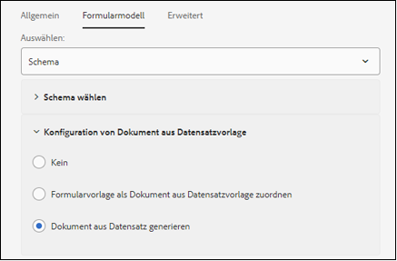
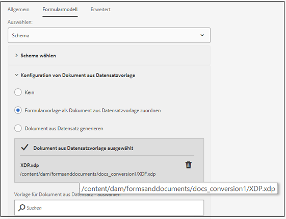

# Empfohlene Workflows zum Generieren des Datensatzdokuments für adaptive Formulare {#recommended-workflows-dor-generation}

Mit dem Datensatzdokument (DoR) können Sie die von Ihnen bereitgestellten und in einem adaptiven Formular übermittelten Informationen aufzeichnen, damit Sie später darauf zurückgreifen können.
Das Datensatzdokument verwendet eine Basisvorlage, um sein Layout zu definieren. Sie können ein Datensatzdokument entweder mithilfe einer Standardvorlage generieren oder dazu eine andere Vorlage mit dem adaptiven Formular verknüpfen.

Weitere Informationen finden Sie unter [Generieren von Datensatzdokumenten für adaptive Formulare](https://helpx.adobe.com/de/experience-manager/6-5/forms/using/generate-document-of-record-for-non-xfa-based-adaptive-forms.html).

Der [Dienst „Automatische Formularkonvertierung“](/help/using/introduction.md) konvertiert die folgenden Quellformulare in adaptive Formulare:

* nicht-interaktive PDF-Formulare
* Acro Forms
* XFA-basierte PDF-Formulare

Basierend auf dem Quellformular, das Sie für die Konvertierung verwenden, können Sie ein Datensatzdokument generieren, indem Sie:

* eine Standardvorlage verwenden
* das Quellformular als Vorlage verwenden: Wenn Sie diese Option auswählen, ordnet der Konvertierungsdienst das Quellformular automatisch dem konvertierten adaptiven Formular als Datensatzdokument-Vorlage zu.
* eine andere Vorlage mit dem konvertierten adaptiven Formular verknüpfen

Die folgende Tabelle zeigt ein Beispiel dafür, wie sich die von Ihnen verwendete Datensatzdokument-Vorlage auf das Layout des generierten Datensatzdokuments auswirkt:

<table> 
 <tbody>
 <tr>
  <td>
<strong>Quellformular</strong>
</td>
  <td>
<strong>Generiertes Datensatzdokument</strong>
</td> 
   </tr>
  <tr>
   <td></td>
   <td>
Wenn Sie die Standardvorlage zum Generieren des Datensatzdokuments verwenden: </td>
   </tr>
   <tr>
   <td></td>
   <td>
Wenn Sie das Quellformular als Vorlage zum Generieren des Datensatzdokuments verwenden: 
</td>
   </tr>
  </tbody>
</table>

Wie in der Tabelle dargestellt, behält das Datensatzdokument das Layout des Quellformulars bei, wenn Sie das Quellformular als Vorlage verwenden.
Dieser Artikel beschreibt die empfohlenen Pfade zum Generieren eines Datensatzdokuments basierend auf den drei Typen von Quellformularen.

<table> 
 <tbody> 
  <tr> 
   <th><strong>Quellformular</strong></th> 
   <th><strong>Methoden zum Erstellen von Datensatzdokumenten</strong></th> 
  </tr> 
  <tr> 
   <td>
Nicht-interaktive PDF-Formulare
</td> 
   <td> 
    <ul> 
     <li><a href="#generate-document-of-record-using-cloud-configuration">Aktivieren Sie die Datensatzdokument-Generierung vor der Konvertierung in ein adaptives Formular, um Datensatzdokumente mithilfe einer Standardvorlage zu generieren</a></li> 
     <li><a href="#edit-adaptive-form-properties-generate-document-of-record">Bearbeiten Sie die Eigenschaften des adaptiven Formulars nach der Konvertierung in ein adaptives Formular, um die Datensatzdokument-Generierung mithilfe der Standard- oder einer anderen Formularvorlage zu ermöglichen</a></li> 
    </ul> </td> 
  </tr>
  <tr> 
   <td>
Acro Forms oder XFA-basierte PDF-Formulare
</td> 
   <td> 
    <ul> 
     <li><a href="#use-input-form-as-template-to-generate-document-of-record">Aktivieren Sie die Datensatzdokument-Generierung vor der Konvertierung in ein adaptives Formular, um Datensatzdokumente mithilfe des Quellformulars als Vorlage zu generieren</a></li> 
     <li><a href="#edit-adaptive-form-properties-to-generate-document-of-record">Bearbeiten Sie die Eigenschaften des adaptiven Formulars nach der Konvertierung des adaptiven Formulars, um die Datensatzdokument-Generierung unter Verwendung der Standardvorlage, des Quellformulars als Vorlage oder einer beliebigen anderen Formularvorlage zu ermöglichen</a></li> 
    </ul> </td> 
  </tr>    
 </tbody> 
</table>

## Generieren eines Datensatzdokuments für nicht-interaktive PDF-Formulare {#generate-document-of-record-non-interactive-pdf}

Wenn Sie ein nicht-interaktives PDF-Formular als Quellformular für den Dienst zur automatischen Formularkonvertierung verwenden, haben Sie folgende Möglichkeiten:

* Aktivieren Sie die Datensatzdokument-Generierung vor der Konvertierung des adaptiven Formulars, um das Datensatzdokument mithilfe einer Standardvorlage zu generieren
* Bearbeiten Sie die Eigenschaften des adaptiven Formulars nach der Konvertierung des adaptiven Formulars, um die Datensatzdokument-Generierung mithilfe der Standard- oder einer anderen Formularvorlage zu aktivieren

### Aktivieren der Datensatzdokument-Generierung vor der Konvertierung adaptiver Formulare, um Datensatzdokumente mithilfe einer Standardvorlage zu generieren {#generate-document-of-record-using-cloud-configuration}

1. Wählen Sie die Option **[!UICONTROL Tools]** > **[!UICONTROL Cloud-Dienste]** > **[!UICONTROL Konfiguration der automatischen Formularkonvertierung]** > Eigenschaften der für die Konvertierung verwendeten Cloud-Konfiguration > **[!UICONTROL Erweitert]** > **[!UICONTROL Datensatzdokument erstellen]**.

   

1. Tippen Sie auf **[!UICONTROL Speichern und Schließen]**, um die Einstellungen zu speichern.

1. [Führen Sie die Konvertierung aus](/help/using/convert-existing-forms-to-adaptive-forms.md). Stellen Sie sicher, dass Sie die in Schritt 1 dieser Anleitung bearbeitete Cloud-Konfiguration verwenden.
Beim Senden des konvertierten adaptiven Formulars wird das Datensatzdokument automatisch unter Verwendung der Standardvorlage generiert.

### Bearbeiten der Eigenschaften adaptiver Formulare nach der Konvertierung, um die Datensatzdokument-Generierung zu ermöglichen {#edit-adaptive-form-properties-generate-document-of-record}

Wenn Sie die Datensatzdokument-Generierung nicht aktivieren, bevor Sie das Quellformular in ein adaptives Formular konvertieren, können Sie dies auch nach der Konvertierung tun.

1. [Führen Sie die Konvertierung](/help/using/convert-existing-forms-to-adaptive-forms.md) des nicht-interaktiven PDF-Formulars aus, um ein adaptives Formular zu generieren.

1. Wählen Sie das adaptive Formular im **[!UICONTROL Ausgabeordner]** aus und wählen Sie **[!UICONTROL Eigenschaften]**.

1. Auf der Registerkarte **[!UICONTROL Formularmodell]** erweitern Sie den Abschnitt **[!UICONTROL Konfiguration der Datensatzdokumentvorlage]** und wählen Sie **[!UICONTROL Datensatzdokument generieren]**.

   

1. Tippen Sie auf **[!UICONTROL Speichern und Schließen]**, um die Einstellungen zu speichern.

Beim Senden des konvertierten adaptiven Formulars wird das Datensatzdokument automatisch unter Verwendung der Standardvorlage generiert. Wenn Sie dem konvertierten adaptiven Formular eine andere Datensatzdokumentvorlage zuordnen möchten, können Sie die Option **[!UICONTROL Formularvorlage als Datensatzdokumentvorlage verknüpfen]** auswählen.

## Generierung eines Datensatzdokuments für Acro Forms oder XFA-basierte PDF-Formulare {#generate-document-of-record-acroform-xfaform}

Wenn Sie ein Acro Form oder ein XFA-basiertes PDF-Formular als Quellformular für den Dienst zur automatischen Formularkonvertierung verwenden, haben Sie folgende Möglichkeiten:

* Aktivieren Sie die Datensatzdokument-Generierung vor der Konvertierung in ein adaptives Formular, um das Datensatzdokument mit dem Quellformular als Vorlage zu generieren

* oder bearbeiten Sie die Eigenschaften des adaptiven Formulars nach der Konvertierung in ein adaptives Formular, um die Datensatzdokument-Generierung unter Verwendung der Standardvorlage, des Quellformulars als Vorlage oder einer beliebigen anderen Formularvorlage zu ermöglichen

### Aktivieren der Datensatzdokument-Generierung vor der Konvertierung, um Datensatzdokumente mithilfe einer Quellvorlage zu generieren {#use-input-form-as-template-to-generate-document-of-record}

1. Wählen Sie die Option **[!UICONTROL Tools]** > **[!UICONTROL Cloud-Dienste]** > **[!UICONTROL Konfiguration der automatischen Formularkonvertierung]** > Eigenschaften der für die Konvertierung verwendeten Cloud-Konfiguration > **[!UICONTROL Erweitert]** > **[!UICONTROL Datensatzdokument erstellen]**.

1. Tippen Sie auf **[!UICONTROL Speichern und Schließen]**, um die Einstellungen zu speichern.

1. [Führen Sie die Konvertierung aus](/help/using/convert-existing-forms-to-adaptive-forms.md). Stellen Sie sicher, dass Sie die in Schritt 1 dieser Anleitung bearbeitete Cloud-Konfiguration verwenden.
Der Konvertierungsdienst ordnet automatisch das Acro Form bzw. XFA-basierte PDF-Formular dem konvertierten adaptiven Formular als DoR-Vorlage zu.
Sie können die Eigenschaften des adaptiven Formulars öffnen, um die Datensatzdokument-Vorlage im Abschnitt **[!UICONTROL Konfiguration der Datensatzdokumentvorlage]** der Registerkarte **[!UICONTROL Formularmodell]** anzuzeigen.

   

   Beim Senden des konvertierten adaptiven Formulars wird das Datensatzdokument automatisch unter Verwendung der Quellformularvorlage generiert.

### Bearbeiten der Eigenschaften adaptiver Formulare nach der Konvertierung, um die Datensatzdokument-Generierung zu ermöglichen {#edit-adaptive-form-properties-to-generate-document-of-record}

1. [Führen Sie die Konvertierung](/help/using/convert-existing-forms-to-adaptive-forms.md) des nicht-interaktiven PDF-Formulars aus, um ein adaptives Formular zu generieren.

1. Wählen Sie das adaptive Formular im **[!UICONTROL Ausgabeordner]** aus und wählen Sie **[!UICONTROL Eigenschaften]**.

1. Auf der Registerkarte **[!UICONTROL Formularmodell]** erweitern Sie den Abschnitt **[!UICONTROL Konfiguration der Datensatzdokumentvorlage]** und wählen Sie **[!UICONTROL Datensatzdokument generieren]**, um die Datensatzdokumentgenerierung unter Verwendung der Standardvorlage zu aktivieren.
Sie können auch die Option **[!UICONTROL Formularvorlage als Datensatzdokumentvorlage verknüpfen]** auswählen und die Vorlage auswählen, um die Generierung des Datensatzdokuments mithilfe der Quellformularvorlage oder einer anderen Formularvorlage zu aktivieren.

1. Tippen Sie auf **[!UICONTROL Speichern und Schließen]**, um die Einstellungen zu speichern.
