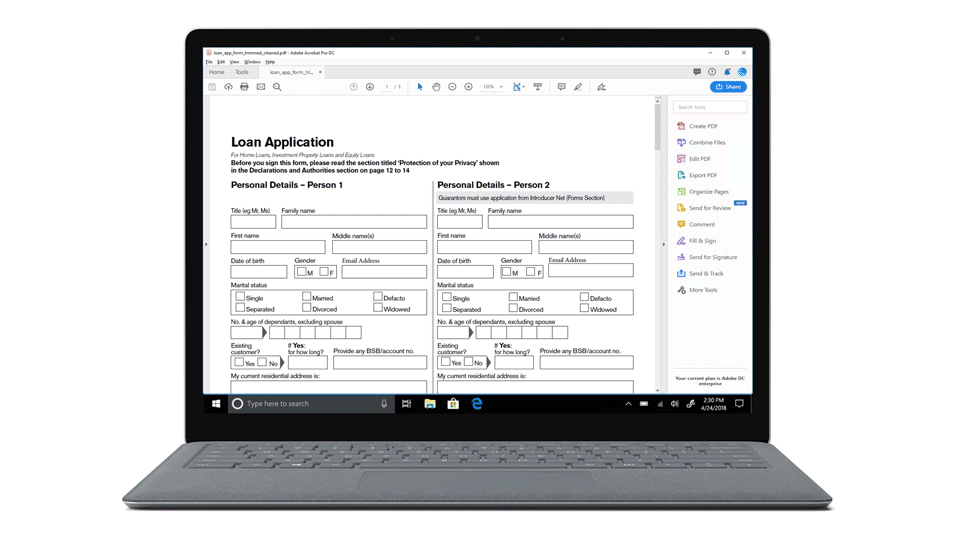

# Dienst für die automatisierte Formularkonvertierung (AFCS) {#introduction-to-automated-forms-conversion-service}

Der Service für die automatische Formularkonvertierung (AFCS) beschleunigt die Digitalisierung und Modernisierung von Erlebnissen mit Datenerfassung, indem PDF forms automatisch in adaptive Formulare konvertiert wird. Der von Adobe Sensei unterstützte Service konvertiert Ihre PDF-Formulare automatisch in gerätefreundliche, responsive und HTML5-basierte adaptive Formulare. Der Service nutzt die vorhandenen Investitionen in PDF-Formulare und XFA und wendet während der Konvertierung auch entsprechende Validierungen, Stile und Layouts auf adaptive Formularfelder an. Der Service hilft bei Folgendem:

* Einsparung von manuellem Aufwand beim Konvertieren von Druckformularen in adaptive Formulare
* Anwendung von Mustern und entsprechender Validierungen während der Konvertierung
* Generieren eines Datensatzdokuments während der Konvertierung
* Gruppieren häufig vorkommender Felder in wiederverwendbare Formularfragmente
* Aktivierung von Adobe Analytics während der Konvertierung

## Onboarding {#onboarding}

Der Service steht AEM 6.5 Forms- und AEM 6.5 LTS Forms On-Premise-Privatkunden sowie Adobe-Managed Service-Unternehmenskunden kostenlos zur Verfügung. Sie können sich an das Adobe Sales-Team oder Ihren Adobe-Support-Mitarbeiter wenden, um Zugriff auf den Service anzufordern. Der Service ist auch für Kunden von AEM Forms as a Cloud Service kostenlos und verfügbar und vorkonfiguriert.

Adobe ermöglicht den Zugriff für Ihre Organisation und stellt der in Ihrer Organisation als Administrator genannten Person die erforderlichen Berechtigungen zur Verfügung. Der Administrator kann den AEM Forms-Entwicklern (Benutzern) Ihrer Organisation Zugriff gewähren, um eine Verbindung zum Service herzustellen. Genaue Anweisungen finden Sie unter [Service zur automatischen Formularkonvertierung konfigurieren](configure-service.md).

## Unterstützte PDF-Formulare und Sprachen {#supported-languages-and-pdf-forms}

Der Service unterstützt nicht-interaktive PDF-Formulare, Formulare, die mit Adobe Acrobat erstellt wurden (AcroForms), und XFA-basierte Formulare, die mit AEM Forms oder Adobe LiveCycle erstellt wurden.

Der Service unterstützt auch Adobe Sign-aktivierte PDF-Formulare. Wenn das Ausgangs-PDF-Formular mit Adobe Sign-Text-Tags versehen ist, bewahrt der Service alle Adobe Sign-Informationen während der Konvertierung auf und verknüpft die im Ausgangs-PDF vorhandenen Unterzeichnerinformationen mit den entsprechenden anpassbaren Formularfeldern. Die Funktion ist nur für AcroForms verfügbar.

Der Service kann Formulare auf Deutsch, Englisch, Französisch Italienisch, Portugiesisch und Spanisch in adaptive Formulare konvertieren. Sie können die generierten adaptiven Formulare auch mithilfe des [AEM-Übersetzungs-Workflows](https://helpx.adobe.com/de/experience-manager/6-5/forms/using/using-aem-translation-workflow-to-localize-adaptive-forms.html) in andere Sprachen übersetzen.

## KonvertierungsWorkflow  {#conversion-workflow}

Der Dienst für die automatisierte Formularkonvertierung (AFCS) wird auf Adobe Cloud ausgeführt. Sie verbinden Ihre AEM-Instanz mit dem Service, laden Formulare in Ihre AEM-Instanz hoch und starten die Konvertierung. Der vollständige Konvertierungsprozess läuft ab wie folgt:

### &#x200B;1. Einrichten der Umgebung {#set-up-the-environment}

Der Dienst für die automatisierte Formularkonvertierung (AFCS) wird auf Adobe Cloud ausgeführt. [Konfigurieren Sie das Adobe I/O-Konto Ihrer Organisation und verbinden Sie Ihre lokale AEM-Instanz](configure-service.md) mit dem Konvertierungsdienst, der in Adobe Cloud ausgeführt wird. Für AEM 6.5 und AEM 6.5 LTS müssen Sie die Kernkomponenten für adaptive Formulare aktivieren, wenn Sie auf Kernkomponenten basierende Vorlagen und Designs verwenden. Siehe [Konfigurieren des Service](configure-service.md#referencepackage).

### &#x200B;2. Konvertieren von PDF-Formularen in adaptive Formulare {#use-the-conversion-service}

Nachdem Sie Ihre AEM Forms-Umgebung konfiguriert haben, konvertieren Sie Ihre PDF-Formulare in adaptive Formulare, indem Sie [PDF-Formulare in Ihre AEM-Instanz hochladen](convert-existing-forms-to-adaptive-forms.md) und die [Konvertierung starten](convert-existing-forms-to-adaptive-forms.md#run-the-conversion). Beachten Sie vor dem Hochladen der Formulare Folgendes:

* Laden Sie nicht die gesicherten Formulare hoch. Der Service konvertiert keine kennwortgeschützten und verschlüsselten Formulare.
* Laden Sie keine gescannten, farbigen, ausgefüllten Formulare oder Formulare in einer anderen Sprache als Deutsch, Englisch, Französisch, Italienisch, Portugiesisch und Spanisch hoch. Solche Formulare werden nicht unterstützt.
* Laden Sie keine PDF-Formulare mit Leerzeichen im Dateinamen hoch.
* Laden Sie keine [PDF-Portfolios](https://helpx.adobe.com/de/acrobat/using/overview-pdf-portfolios.html) hoch. Der Service konvertiert keine PDF-Portfolios in ein adaptives Formular.
* Nehmen Sie die vorgeschlagenen Änderungen in PDF-Formularen vor, wie sie im Artikel [Best Practices und Überlegungen](styles-and-pattern-considerations-and-best-practices.md) beschrieben werden.
* Lesen Sie den Artikel [Bekannte Probleme](known-issues.md), um Fallstricke zu vermeiden.

### &#x200B;3. Überprüfen konvertierter Formulare {#review-converted-forms}

Reale Formulare können komplexe Anforderungen an die Datenerfassung in Bezug auf Feld-Layout, Benennung oder implizite Vorschläge haben, die von der KI/ML-basierten Erkennungslogik möglicherweise nicht genau erfasst werden. Sobald die automatische Konvertierung abgeschlossen ist, können Sie im Editor [Überprüfen und Korrigieren](review-correct-ui-edited.md) das konvertierte Formular überprüfen, erforderliche Aktualisierungen vornehmen und eine verbesserte Ausgabe generieren, die dem gewünschten Ergebnis näher kommt. Nachdem Sie die erforderlichen Änderungen vorgenommen haben, senden Sie das Formular erneut zur Konvertierung.

Die für die automatische Konvertierung benötigte Zeit hängt von verschiedenen Faktoren ab, z. B. der Größe und Komplexität des Eingabeformulars und der Beanspruchung der Verarbeitungswarteschlange des Service. Der Benutzer wird regelmäßig über die Statusanzeige im Ordner/in der Datei über den Fortschritt informiert. Nach Abschluss der Konvertierung wird auch eine E-Mail-Benachrichtigung an die konfigurierte E-Mail-Adresse gesendet.

