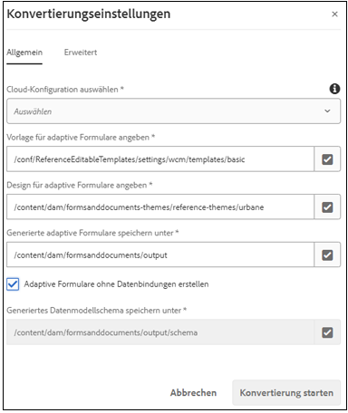
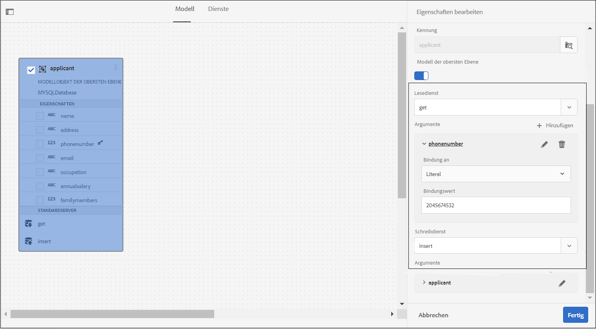
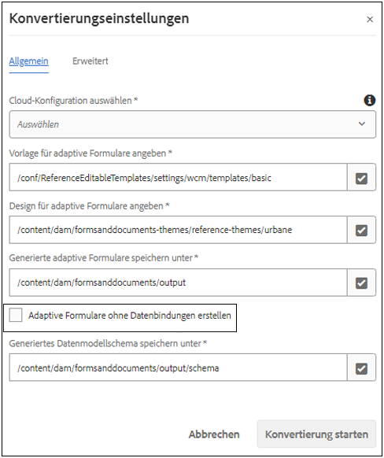

# Empfohlene datenquellenbasierte Vorfüll- und Übermittlungs-Workflows für adaptive Formulare {#recommended-data-source-btased-prefill-and-submit-workflows-for-adaptive-forms}

Sie können eine der folgenden Datenquellen mit adaptiven Formularen verwenden, die mithilfe des Automated forms conversion-Dienstes (AFCS) konvertiert wurden:

* Formulardatenmodell, OData oder andere Dienste von Drittanbietern
* JSON-Schema
* XSD-Schema

Basierend auf der Datenquelle können Sie ein adaptives Formular mit oder ohne Datenmodell erstellen.

In diesem Artikel werden die empfohlenen Arbeitsabläufe zum Vorausfüllen von Feldwerten und Übermittlungsoptionen beschrieben, nachdem eine Datenquelle ausgewählt und ein adaptives Formular mit dem Konvertierungsdienst generiert wurde.

<table> 
 <tbody> 
  <tr> 
   <th><strong>Datenquelle</strong></th> 
   <th><strong>Empfohlener Arbeitsablauf</strong></th> 
  </tr> 
  <tr> 
   <td><p>Formulardatenmodell, OData oder andere Dienste von Drittanbietern</p></td> 
   <td> 
    <p><strong>Option 1</strong>: Sie wählen ein Formulardatenmodell, OData oder einen anderen Drittanbieter-Dienst als Datenquelle aus. You <a href="#generate-adaptive-forms-with-no-data-binding">Erstellen eines adaptiven Formulars ohne Datenbindung</a> Verwendung des Automated forms conversion-Dienstes (AFCS). Sie binden die adaptiven Formularfelder manuell an Entitäten des Formulardatenmodells und verwenden die Option „Vorfüllservice für Formulardatenmodell“, um Feldwerte vorab auszufüllen. Verwenden Sie die Option „Senden mit Formulardatenmodell“, um das adaptive Formular zu senden.</p></td> 
  </tr>
  <tr> 
   <td></td> 
   <td> 
   <p><strong>Option 2</strong>: Sie wählen Formulardatenmodell, OData oder einen anderen Drittanbieter-Dienst als Datenquelle aus. You <a href="#generate-adaptive-forms-with-no-data-binding">Erstellen eines adaptiven Formulars ohne Datenbindung</a> Verwendung des Automated forms conversion-Dienstes (AFCS). Sie binden die adaptiven Formularfelder mithilfe des Regeleditors, um Feldwerte vorab auszufüllen. Ändern Sie gegebenenfalls die Feldwerte und senden Sie die Daten an das crx-Repository.</p>
    </td> 
  </tr>
  <tr> 
   <td></td> 
   <td> 
    <p>Eine schrittweise Anleitung zum Ausführen dieser Arbeitsabläufe finden Sie unter <a href="#sqldatasource">Datenbank, OData oder Dienste von Drittanbietern als Datenquelle verwenden</a>.</p> </td> 
  </tr>
  <tr>
  <td><p>JSON-Schema</p></td> 
   <td> 
    <p>Sie wählen JSON-Schema als Datenquelle aus. Basierend auf der ausgewählten Datenquelle:</p></td> 
  </tr>
  <tr>
  <td></td> 
   <td> 
    <p><strong>Option 1</strong>: Sie <a href="#generate-adaptive-forms-with-no-data-binding">Erstellen eines adaptiven Formulars ohne Datenbindung</a> Verwendung des Automated forms conversion-Dienstes (AFCS) und Konfigurieren des JSON-Schemas als Datenquelle. Sie binden die Felder des adaptiven Formulars manuell an das JSON-Schema und <a href="https://helpx.adobe.com/de/experience-manager/6-5/forms/using/prepopulate-adaptive-form-fields.html#Supportedprotocolsforprefillinguserdata" target="_blank">verwenden eines der unterstützten Protokolle</a>, um Feldwerte im Voraus auszufüllen. Ändern Sie gegebenenfalls die Feldwerte und senden Sie die Daten an das crx-Repository.</p></td> 
  </tr>
  <tr>
  <td></td> 
   <td> 
    <p>Eine schrittweise Anleitung zum Ausführen der Arbeitsabläufe finden Sie unter <a href="#jsondatasource">JSON-Schema als Datenquelle verwenden.</p></td> 
  </tr>
  <tr>
  <td></td> 
   <td> 
    <p><strong>Option 2</strong>: Sie <a href="#generate-adaptive-forms-with-json-binding">Erstellen eines adaptiven Formulars mit JSON-Datenbindung</a> Verwendung des Automated forms conversion-Dienstes (AFCS). Die Funktionen zum Vorausfüllen und zum Senden funktionieren nahtlos. Sie benötigen keine Konfigurationsschritte.</p> </td> 
  </tr>
   <tr>
  <td></td> 
   <td> 
    <p>Eine schrittweise Anleitung zum Ausführen der Arbeitsabläufe finden Sie unter <a href="#jsonwithdatabinding">JSON-Schema als Datenquelle verwenden.</a></p> </td> 
  </tr>
  <tr>
  <td><p>XSD-Schema</p></td> 
   <td> 
    <p>Sie wählen XSD-Schema als Datenquelle aus. Basierend auf der ausgewählten Datenquelle <a href="#generate-adaptive-forms-with-no-data-binding">Erstellen eines adaptiven Formulars ohne Datenbindung</a> Verwenden des Automated forms conversion-Dienstes (AFCS) und Konfigurieren des XSD-Schemas als Datenquelle. Sie binden die Felder des adaptiven Formulars manuell an das XSD-Schema und <a href="https://helpx.adobe.com/de/experience-manager/6-5/forms/using/prepopulate-adaptive-form-fields.html#Supportedprotocolsforprefillinguserdata" target="_blank">verwenden eines der unterstützten Protokolle</a>, um Feldwerte im Voraus auszufüllen. Ändern Sie gegebenenfalls die Feldwerte und senden Sie die Daten an das crx-Repository.</p>
    </td> 
  </tr>
  <tr>
  <td></td> 
   <td> 
    <p>Eine schrittweise Anleitung zum Ausführen der Arbeitsabläufe finden Sie unter <a href="#xsddatasource">XSD-Schema als Datenquelle verwenden.</a></p>
    </td> 
  </tr>
 </tbody> 
</table>


Weitere Informationen zum Automated forms conversion-Dienst (AFCS) finden Sie in den folgenden Artikeln:

* [Einführung in den Dienst für die automatische Formularkonvertierung (AFCS)](introduction.md)
* [Konfigurieren des Dienstes für die automatische Formularkonvertierung](configure-service.md)
* [Konvertieren von Druckformularen in adaptive Formulare](convert-existing-forms-to-adaptive-forms.md)
* [Überprüfen und Korrigieren konvertierter Formulare](review-correct-ui-edited.md)

Den Informationen in diesem Artikel liegt die Annahme zugrunde, dass alle, die ihn lesen, über Grundkenntnisse der Konzepte für adaptive Formulare verfügen.

## Voraussetzungen {#pre-requisites}

* Konfigurieren einer [AEM-Autoreninstanz](https://helpx.adobe.com/de/experience-manager/6-5/sites/deploying/using/deploy.html)
* Konfigurieren [Automated forms conversion-Dienst (AFCS) in der AEM-Autoreninstanz](configure-service.md)

## Beispiel für ein adaptives Formular {#sample-adaptive-form}

Laden Sie die folgende PDF-Beispieldatei herunter, um die Anwendungsfälle zum Vorausfüllen von Feldwerten in einem adaptiven Formular und zum Senden des Formulars an die Datenquelle auszuführen.

Beispielformular für einen Kreditantrag

[Datei abrufen](assets/sample_loan_application_form.pdf)

Die PDF-Datei dient als Eingabe für den Automated forms conversion-Dienst (AFCS). Der Dienst konvertiert diese Datei in ein adaptives Formular. Das folgende Bild zeigt das Beispiel eines Kreditantrags im PDF-Format.


## Vorbereiten der Daten für das Formularmodell {#prepare-data-for-form-model}

Mit der AEM Forms-Datenintegration können Sie unterschiedliche Datenquellen konfigurieren und Verbindungen zu ihnen herzustellen. Nach dem Generieren eines adaptiven Formulars mithilfe des Konvertierungsprozesses können Sie das Formularmodell basierend auf einem Formulardatenmodell, XSD oder einem JSON-Schema definieren. Sie können eine Datenbank, Microsoft Dynamics oder einen anderen Dienst eines Drittanbieters verwenden, um ein Formulardatenmodell zu erstellen.

In diesem Lernprogramm wird die MySQL-Datenbank als Quelle zum Erstellen eines Formulardatenmodells verwendet. Erstellen Sie ein Schema **loanapplication** in der Datenbank und fügen Sie dem Schema eine Tabelle **applicant** hinzu, basierend auf den Feldern, die im adaptiven Formular verfügbar sind.


Mit der folgenden DDL-Anweisung können Sie die Tabelle **applicant** in der Datenbank erstellen.

```sql
CREATE TABLE `applicant` (
   `name` varchar(45) DEFAULT NULL,
   `address` varchar(45) DEFAULT NULL,
   `phonenumber` int(11) NOT NULL,
   `email` varchar(45) DEFAULT NULL,
   `occupation` varchar(45) DEFAULT NULL,
   `annualsalary` varchar(45) DEFAULT NULL,
   `familymembers` int(11) DEFAULT NULL,
   PRIMARY KEY (`phonenumber`)
 ) ENGINE=InnoDB DEFAULT CHARSET=utf8
```

Wenn Sie ein XSD-Schema als Formularmodell zum Ausführen der Anwendungsfälle verwenden, erstellen Sie eine XSD-Datei mit dem folgenden Text:

```xml
<?xml version="1.0" encoding="utf-8" ?>
    <xs:schema targetNamespace="http://adobe.com/sample.xsd"
                    xmlns="http://adobe.com/sample.xsd"
                    xmlns:xs="http://www.w3.org/2001/XMLSchema">

<xs:element name="sample" type="SampleType"/>

  <xs:complexType name="SampleType">
    <xs:sequence>
      <xs:element name="name" type="xs:string"/>
   <xs:element name="address" type="xs:string"/>
   <xs:element name="phonenumber" type="xs:int"/>
   <xs:element name="email" type="xs:string"/>
   <xs:element name="occupation" type="xs:string"/>
   <xs:element name="annualsalary" type="xs:string"/>
   <xs:element name="familymembers" type="xs:string"/>
 </xs:sequence>
  </xs:complexType>

  </xs:schema>
```

Oder laden Sie das XSD-Schema in das lokale Dateisystem herunter.

Beispiel: XSD-Schema für einen Kreditantrag

[Datei abrufen](assets/loanapplication.xsd)

Weitere Informationen zur Verwendung des XSD-Schemas als Formularmodell in adaptiven Formularen finden Sie unter [Adaptive Formulare mithilfe des XML-Schemas erstellen](https://helpx.adobe.com/de/experience-manager/6-5/forms/using/adaptive-form-xml-schema-form-model.html).

Wenn Sie ein JSON-Schema als Formularmodell zum Ausführen der Anwendungsfälle verwenden, erstellen Sie eine JSON-Datei mit dem folgenden Text:

```JSON
{
    "$schema": "http://json-schema.org/draft-04/schema#",
    "definitions": {
        "loanapplication": {
            "type": "object",
            "properties": {
                "name": {
                    "type": "string"
                },
                "address": {
                    "type": "string"
                },
    "phonenumber": {
                    "type": "number"
                },
    "email": {
                    "type": "string"
                },
    "occupation": {
                    "type": "string"
                },
    "annualsalary": {
                    "type": "string"
                },
    "familymembers": {
                    "type": "number"
                }
            }
        }
 },
 "type": "object",
    "properties": {
        "employee": {
            "$ref": "#/definitions/loanapplication"
        }
    }
}
```

Oder laden Sie das JSON-Schema in das lokale Dateisystem herunter.

Beispiel: JSON-Schema für einen Kreditantrag

[Datei abrufen](assets/demo_schema.json)

Weitere Informationen zur Verwendung des JSON-Schemas als Formularmodell in adaptiven Formularen finden Sie unter [Erstellen adaptiver Formulare mithilfe des JSON-Schemas](https://helpx.adobe.com/de/experience-manager/6-5/forms/using/adaptive-form-json-schema-form-model.html).

## Generieren adaptiver Formulare ohne Datenbindung {#generate-adaptive-forms-with-no-data-binding}

Verwenden Sie den [Dienst für die automatische Formularkonvertierung](convert-existing-forms-to-adaptive-forms.md) zum Konvertieren des [Beispielformulars für einen Kreditantrag](#sample-adaptive-form) in ein adaptives Formular ohne Datenbindung. Stellen Sie sicher, dass das Kontrollkästchen **[!UICONTROL Adaptive(s) Formular(e) ohne Datenbindungen generieren]** aktiviert ist, um das adaptive Formular ohne Datenbindung zu erzeugen.



Wählen Sie nach dem Generieren eines adaptiven Formulars ohne Datenbindung eine Datenquelle für das adaptive Formular aus:

* [Datenbank, OData oder ein beliebiger Drittanbieter-Dienst](#sqldatasource)
* [JSON-Schema](#jsondatasource)
* [XSD-Schema](#xsddatasource)

>[!NOTE]
> Wenn das adaptive Formular, das Sie mit dem Automated forms conversion-Dienst (AFCS) konvertieren, mehrere Felder mit demselben Namen enthält, stellen Sie sicher, dass diese Felder an Datenquellenentitäten gebunden sind, um einen möglichen Datenverlust während der Übermittlung zu vermeiden.
>

### Verwenden einer Datenbank, von OData oder beliebigen Drittanbieter-Diensten als Datenquelle {#sqldatasource}

Anwendungsfall: Sie generieren ein adaptives Formular ohne Datenbindung unter Verwendung des Automated forms conversion-Dienstes (AFCS) und konfigurieren die MYSQL-Datenbank als Datenquelle. Sie binden die adaptiven Formularfelder manuell an Entitäten des Formulardatenmodells und verwenden die Option **[!UICONTROL Vorfüllservice für Formulardatenmodell]**, um Feldwerte vorab auszufüllen. Verwenden Sie die Option **[!UICONTROL Senden mit Formulardatenmodell]**, um das adaptive Formular zu senden.

Vor dem Ausführen des Anwendungsfalls:

* [Konfigurieren der MySQL-Datenbank als Datenquelle](https://helpx.adobe.com/de/experience-manager/6-5/forms/using/configure-data-sources.html#configurerelationaldatabase)
* [Formulardatenmodell erstellen](https://helpx.adobe.com/de/experience-manager/6-5/forms/using/work-with-form-data-model.html)

Erstellen Sie basierend auf dem Anwendungsfall das Formulardatenmodell **loanapplication** und binden Sie das Argument des Lesedienstes an einen **[!UICONTROL Literalwert]**. Der Literalwert für die Telefonnummer muss einer der Datensätze sein, die im Schema **applicant** der MySQL-Datenbank konfiguriert wurden. Die Dienste verwenden den Wert als Argument, um Details aus der Datenquelle abzurufen. Sie können auch [Benutzerprofilattribut oder Anforderungsattribut](https://helpx.adobe.com/de/experience-manager/6-5/forms/using/work-with-form-data-model.html#bindargument) aus der Dropdown-Liste **[!UICONTROL Bindung an]** auswählen



>[!NOTE]
>
>Stellen Sie sicher, dass Sie dem Formulardatenmodell die Dienste **get** und **insert** hinzufügen, konfigurieren und testen, bevor Sie den Anwendungsfall ausführen.

Führen Sie die folgenden Schritte aus:

1. Wählen Sie das konvertierte **Formular für den Beispielkreditantrag** im **[!UICONTROL Ausgabeordner]** und wählen Sie **[!UICONTROL Eigenschaften]**.
1. Wählen Sie auf die Registerkarte **[!UICONTROL Formularmodell]** den Eintrag **[!UICONTROL Formulardatenmodell]** aus der Dropdown-Liste **[!UICONTROL Wählen aus]** und tippen Sie auf **[!UICONTROL Formulardatenmodell auswählen]**, um das Formulardatenmodell **loanapplication** auszuwählen. Tippen Sie auf **[!UICONTROL Speichern und Schließen]**, um das Formular zu speichern.
1. Wählen Sie das **Beispielformular für einen Kreditantrag** und tippen Sie auf **[!UICONTROL Bearbeiten]**.
1. Tippen Sie auf der Registerkarte **[!UICONTROL Inhalt]** auf das Konfigurationssymbol:

   

   1. Wählen Sie im Abschnitt **[!UICONTROL Standard]** den Eintrag **[!UICONTROL Vorfüllservice für Formulardatenmodell]** aus der Dropdown-Liste **[!UICONTROL Vorbefüllungs-Dienst]**.

   1. Wählen Sie im Abschnitt **[!UICONTROL Senden]** den Eintrag **[!UICONTROL Senden mit Formulardatenmodell]** aus der Dropdown-Liste **[!UICONTROL Übermittlungsaktion]**.

   1. Wählen Sie das Datenmodell über das Feld **[!UICONTROL Zu sendendes Datenmodell]** aus.
   1. Tippen Sie auf das , um die Eigenschaften zu speichern.

1. Tippen Sie auf das Textfeld „Name des Antragstellers“ und wählen Sie das  (Konfigurieren).

   1. Wählen Sie im Feld „Bindungsverweis“ die Option **Antragsteller** > **Name** aus und tippen Sie auf das , um die Eigenschaften zu speichern. Erstellen Sie auf ähnliche Weise eine Datenbindung für **Adresse**, **Telefonnummer**, **E-Mail**, **Beruf**, **Jahresgehalt (in Dollar)** und **Anzahl. von abhängigen Familienmitgliedern** mit den Entitäten des Formulardatenmodells.

   

1. Tippen Sie auf **[!UICONTROL Vorschau]**, um die vorausgefüllten Feldwerte des adaptiven Formulars anzuzeigen.
1. Ändern Sie gegebenenfalls die Feldwerte und senden Sie das adaptive Formular. Die Feldwerte werden an die MySQL-Datenbank gesendet. Sie können die Tabelle **applicant** in der Datenbank aktualisieren, um die aktualisierten Werte in der Tabelle anzuzeigen.

**Anwendungsbeispiel:** Sie generieren ein adaptives Formular ohne Datenbindung unter Verwendung des Automated forms conversion-Dienstes (AFCS) und konfigurieren die MYSQL-Datenbank als Datenquelle. Sie binden die adaptiven Formularfelder mithilfe des Regeleditors, um Feldwerte vorab auszufüllen. Ändern Sie gegebenenfalls die Feldwerte und senden Sie die Daten an das crx-Repository.

Führen Sie die folgenden Schritte aus, um mit dem [Regeleditor](https://helpx.adobe.com/de/experience-manager/6-5/forms/using/rule-editor.html) den Formulardatenmodell-Dienst aufzurufen, um in einem adaptiven Formular Felder zu binden und Werte vorzufüllen:

1. Wählen Sie das **Beispielformular für einen Kreditantrag** im Ordner **[!UICONTROL Ausgabe]** und tippen Sie auf **[!UICONTROL Bearbeiten]**.
1. Tippen Sie auf der Registerkarte **[!UICONTROL Inhalt]** auf das Konfigurationssymbol:

   

   Wählen Sie im Abschnitt **[!UICONTROL Standard]** den Eintrag **[!UICONTROL Vorfüllservice für Formulardatenmodell]** aus der Dropdown-Liste **[!UICONTROL Vorbefüllungs-Dienst]**.

1. Tippen Sie auf das Textfeld **[!UICONTROL Name des Antragstellers]** und anschließend auf **[!UICONTROL Regeln bearbeiten]**.

   

1. Tippen Sie auf der Seite Regeleditor auf **[!UICONTROL Erstellen]**.
1. Auf der Seite **[!UICONTROL Regeleditor]**:

   1. Wählen Sie einen Status für das Textfeld „Name des Antragstellers“ aus. Beispiel: **[!UICONTROL Ist initialisiert]**, was zur Ausführung der **[!UICONTROL Dann]**-Bedingung führt , wenn Sie das Formular im Modus **[!UICONTROL Vorschau]** rendern.

   1. Im Abschnitt **[!UICONTROL Dann]** wählen Sie **[!UICONTROL Dienst aufrufen]** aus der Dropdown-Liste **[!UICONTROL Aktion auswählen]**. Alle Dienste Ihrer Formularinstanz werden in der Dropdown-Liste angezeigt.

   1. Wählen Sie im Abschnitt mit den Formulardatenmodellen einen Dienst zum **[!UICONTROL Abrufen]** aus. Das Eingabefeld zeigt die **Telefonnummer** an, die der Primärschlüssel ist, der für das Datenmodell **applicant** definiert ist. Das System ruft die Werte im adaptiven Formular für Felder im Abschnitt „Ausgabe“ ab, die auf diesem Feld basieren, und füllt sie vor.

   1. Erstellen Sie im Abschnitt „Ausgabe“ eine Bindung für die Felder des adaptiven Formulars mit den Entitäten des Formulardatenmodells. Binden Sie beispielsweise das adaptive Formularfeld **[!UICONTROL Antragstellername]** mit der Entität **Name**.

   1. Tippen Sie auf **[!UICONTROL Fertig]**. Tippen Sie auf der Seite „Regeleditor“ auf **[!UICONTROL Fertig]**.

   

1. Tippen Sie auf **[!UICONTROL Vorschau]**, um die vorausgefüllten Feldwerte des adaptiven Formulars anzuzeigen.

   >[!NOTE]
   >
   >Stellen Sie sicher, dass die Eigenschaft **[!UICONTROL Rückgabearray]** für die Diensteigenschaft **get** im Formulardatenmodell, das mit dem adaptiven Formular verknüpft ist, auf „AUS“ eingestellt ist.

1. Ändern Sie gegebenenfalls die Feldwerte und senden Sie das adaptive Formular. Die übermittelten Daten sind an folgendem Ort im crx-Repository verfügbar:

   `http://host name:port/crx/de/index.jsp#/content/forms/fp/admin/submit/data/latest file available in the folder`

### Verwenden eines JSON-Schemas als Datenquelle {#jsondatasource}

**Anwendungsbeispiel:** Sie generieren ein adaptives Formular ohne Datenbindung unter Verwendung des Automated forms conversion-Dienstes (AFCS) und konfigurieren das JSON-Schema als Datenquelle. Sie binden die Felder des adaptiven Formulars manuell an das JSON-Schema und verwenden die Option **Vorschau mit Daten**, um Feldwerte im Voraus auszufüllen. Ändern Sie gegebenenfalls die Feldwerte und senden Sie die Daten an das crx-Repository.

Stellen Sie vor dem Ausführen des Anwendungsfalls sicher, dass Sie über Folgendes verfügen:

* [ein gültiges JSON-Schema, das mit der JSON-Schemastruktur kompatibel ist](#prepare-data-for-form-model)
* [ein adaptives Formular ohne Datenbindung](#generate-adaptive-forms-with-no-data-binding)

Führen Sie die folgenden Schritte aus:

1. Wählen Sie das konvertierte Formular für den **Beispielkreditantrag** im **Ausgabeordner** und wählen Sie **[!UICONTROL Eigenschaften]**.
1. Tippen Sie auf die Registerkarte **[!UICONTROL Formularmodell]** wählen Sie **[!UICONTROL Schema]** aus der Dropdown-Liste **[!UICONTROL Formular auswählen]** und tippen Sie auf **[!UICONTROL Schema auswählen]**, um das Schema **demo.schema JSON**, das im lokalen Dateisystem gespeichert ist, hochzuladen. Tippen Sie auf **[!UICONTROL Speichern und Schließen]**, um das Formular zu speichern.
1. Wählen Sie das **Beispielformular für einen Kreditantrag** und tippen Sie auf **[!UICONTROL Bearbeiten]**.
1. Tippen Sie auf das Textfeld „Name des Antragstellers“ und wählen Sie das  (Konfigurieren).

   Wählen Sie im Feld „Bindungsverweis“ die Option **Antragsteller** > **Name** aus und tippen Sie auf das , um die Eigenschaften zu speichern. Erstellen Sie auf ähnliche Weise eine Datenbindung für **Adresse**, **Telefonnummer**, **E-Mail**, **Beruf**, **Jahresgehalt (in Dollar)** und **Anzahl. von abhängigen Familienmitgliedern** mit den JSON-Schemaentitäten.

1. Wählen Sie das konvertierte **Beispielformular für den Kreditantrag]**, das im Ordner **[!UICONTROL Ausgabe** verfügbar ist, erneut aus, und wählen Sie **[!UICONTROL Vorschau]** > **[!UICONTROL Vorschau mit Daten]**.</br>

   Beispieldatendatei herunterladen</br>

   [Datei laden](assets/json_data_file.txt)</br>

1. Ändern Sie gegebenenfalls die Feldwerte und senden Sie das adaptive Formular. Die übermittelten Daten sind an folgendem Ort im crx-Repository verfügbar:

   `http://host name:port/crx/de/index.jsp#/content/forms/fp/admin/submit/data/latest file available in the folder`

### Verwenden eines XSD-Schemas als Datenquelle {#xsddatasource}

**Anwendungsbeispiel:** Sie generieren ein adaptives Formular ohne Datenbindung mithilfe des Automated forms conversion-Dienstes (AFCS) und konfigurieren das XSD-Schema als Datenquelle. Sie binden die Felder des adaptiven Formulars manuell an das XSD-Schema und verwenden die Option **Vorschau mit Daten**, um Feldwerte im Voraus auszufüllen. Ändern Sie gegebenenfalls die Feldwerte und senden Sie die Daten an das crx-Repository.

Stellen Sie vor dem Ausführen des Anwendungsfalls sicher, dass Sie über Folgendes verfügen:

* [ein gültiges XSD-Schema, das mit der XML-Schemastruktur kompatibel ist](#prepare-data-for-form-model)
* [ein adaptives Formular ohne Datenbindung](#generate-adaptive-forms-with-no-data-binding)

Führen Sie die folgenden Schritte aus:

1. Wählen Sie das konvertierte **Formular für den Beispielkreditantrag** im **[!UICONTROL Ausgabeordner]** und wählen Sie **[!UICONTROL Eigenschaften]**.
1. Tippen Sie auf die Registerkarte **[!UICONTROL Formularmodell]**, wählen Sie **[!UICONTROL Schema]** aus der Dropdown-Liste **[!UICONTROL Formular auswählen]** und tippen Sie auf **[!UICONTROL Schema auswählen]**, um das Schema **loanapplication**, das im lokalen Dateisystem gespeichert ist, hochzuladen. Wählen Sie das Stammelement für das XSD-Schema aus und tippen Sie auf **[!UICONTROL Speichern und Schließen]**, um das Formular zu speichern.
1. Wählen Sie das **Beispielformular für einen Kreditantrag** und tippen Sie auf **[!UICONTROL Bearbeiten]**.
1. Tippen Sie auf das Textfeld „Name des Antragstellers“ und wählen Sie das  (Konfigurieren).
Wählen Sie im Feld „Bindungsverweis“ die Option **Antragsteller** > **Name** aus und tippen Sie auf das , um die Eigenschaften zu speichern. Erstellen Sie auf ähnliche Weise eine Datenbindung für **Adresse**, **Telefonnummer**, **E-Mail**, **Beruf**, **Jahresgehalt (in Dollar)** und **Anzahl. von abhängigen Familienmitgliedern** mit den XSD-Schemaentitäten.

1. Wählen Sie das konvertierte **Beispielformular für den Kreditantrag**, das im Ordner **Ausgabe** verfügbar ist, erneut aus, und wählen Sie **[!UICONTROL Vorschau]** > **[!UICONTROL Vorschau mit Daten]**.</br>

   Beispieldatendatei herunterladen</br>

   [Datei laden](assets/loan-application-data-xml-data.zip)</br>


1. Ändern Sie gegebenenfalls die Feldwerte und senden Sie das adaptive Formular. Die übermittelten Daten sind an folgendem Ort im crx-Repository verfügbar:

   `http://host name:port/crx/de/index.jsp#/content/forms/fp/admin/submit/data/latest file available in the folder`

## Generieren adaptiver Formulare mit JSON-Bindung {#generate-adaptive-forms-with-json-binding}

Verwenden Sie die [Automated forms conversion-Dienst (AFCS) zum Konvertieren](convert-existing-forms-to-adaptive-forms.md) die [Beispielformular für einen Kreditantrag](#sample-adaptive-form) in ein adaptives Formular mit Datenbindung. Stellen Sie sicher, dass Sie nicht das Kontrollkästchen **[!UICONTROL Adaptive(s) Formular(e) ohne Datenbindungen generieren]** aktivieren, während das adaptive Formular generiert wird.



### Verwenden eines JSON-Schemas als Datenquelle {#jsonwithdatabinding}

**Anwendungsbeispiel:** Sie generieren ein adaptives Formular mit JSON-Datenbindung unter Verwendung des Automated forms conversion-Dienstes (AFCS). Die Funktionen zum Vorausfüllen und zum Senden funktionieren nahtlos. Sie benötigen keine Konfigurationsschritte.

Stellen Sie vor dem Ausführen des Anwendungsfalls sicher, dass Sie über ein [adaptives Formular mit Datenbindung verfügen](#generate-adaptive-forms-with-json-binding).

Führen Sie die folgenden Schritte aus:

1. Wählen Sie das konvertierte **Beispielformular für den Kreditantrag]**, das im Ordner **[!UICONTROL Ausgabe** verfügbar ist, erneut aus, und wählen Sie **[!UICONTROL Vorschau]** > **[!UICONTROL Vorschau mit Daten]**.</br>

   Beispieldatendatei herunterladen</br>

   [Datei laden](assets/loan_application_data_source_json_data_binding.txt)</br>

1. Ändern Sie gegebenenfalls die Feldwerte und senden Sie das adaptive Formular. Die übermittelten Daten sind an folgendem Ort im crx-Repository verfügbar:

   `http://host name:port/crx/de/index.jsp#/content/forms/fp/admin/submit/data/latest file available in the folder`

## Konvertieren der übermittelten JSON-Daten im adaptiven Formular in das XML-Format {#convert-submitted-adaptive-form-data-to-xml}

Wenn Sie Werte in adaptive Formularfelder eingeben und senden, sind die Daten im JSON-Format im crx-Repository verfügbar. Sie können das Format von JSON-Daten entweder mit der API [org.apache.sling.commons.json.xml](https://sling.apache.org/de/apidocs/sling5/org/apache/sling/commons/json/xml/XML.html#toString) oder dem folgenden Beispielcode in XML konvertieren:

```
import org.apache.sling.commons.json.JSONException;
import org.apache.sling.commons.json.JSONObject;
import org.apache.sling.commons.json.xml.XML;
 
public class ConversionUtils {
 
    public static String jsonToXML(String jsonString) throws JSONException {
        //https://sling.apache.org/apidocs/sling5/org/apache/sling/commons/json/xml/XML.html#toString(java.lang.Object)
        //jar - http://maven.ibiblio.org/maven2/org/apache/sling/org.apache.sling.commons.json/2.0.18/
        //Note: Need to extract boundData part before converting to XML
        return XML.toString(new JSONObject(jsonString));
    }
}
```
