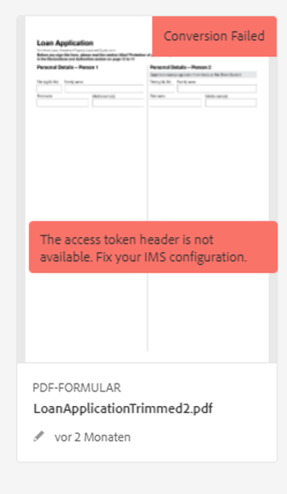
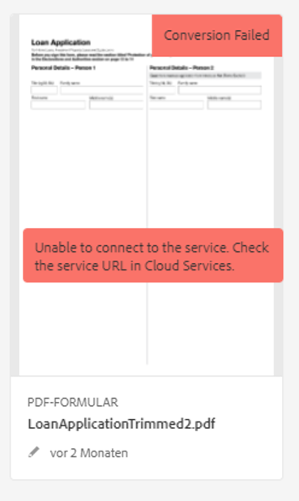
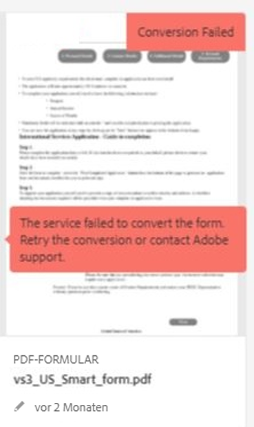
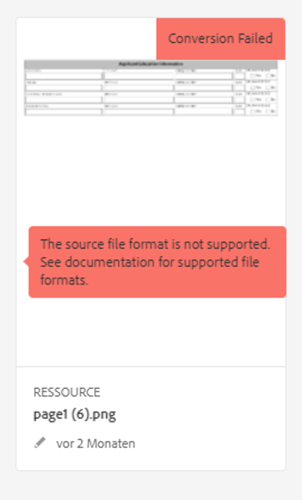
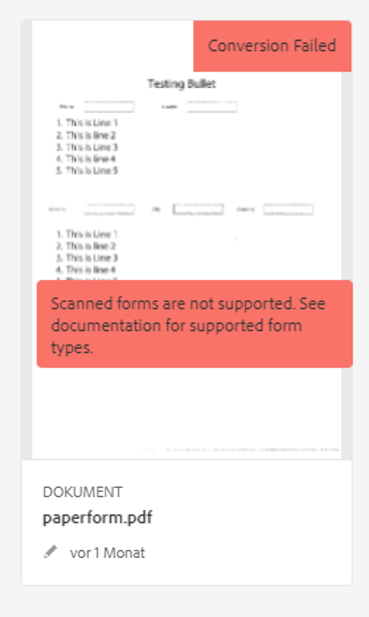
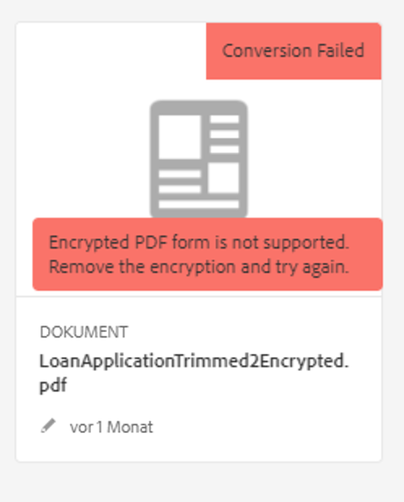
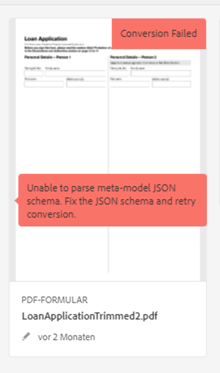
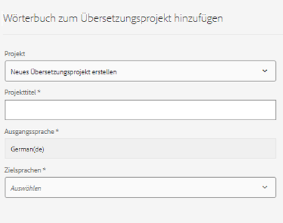

# Fehlerbehebung für den Dienst für die automatische Formularkonvertierung

Das Dokument enthält grundlegende Schritte zur Fehlerbehebung bei häufigen Fehlern.

<!--The article provides information on installation, configuration and administration issues that may arise in an Automated Forms Conversion Service production environment. -->

## Allgemeine Fehler {#commonerrors}

| Fehler | Beispiel |
|--- |--- |
| **Fehlermeldung**   Der Kopfzeile des Zugriffstokens ist nicht verfügbar.    **Grund**  Ein Administrator hat mehrere IMS-Konfigurationen erstellt, oder die IMS-Konfiguration kann den AFCS-Dienst in Adobe Cloud nicht erreichen.   **Lösung**   Wenn mehrere Konfigurationen vorhanden sind, löschen Sie alle Konfigurationen und [erstellen Sie eine neue Konfiguration](configure-service.md#obtainpubliccertificates).  Wenn es eine einzelne Konfiguration gibt, verwenden Sie die **Integritätsprüfung**, um die [Konnektivität](configure-service.md#createintegrationoption) zu überprüfen. |  |
| **Fehlermeldung**   Es kann keine Verbindung zum Dienst hergestellt werden.    **Grund**   In den Cloud-Diensten des Dienstes für die automatische Formularkonvertierung wird eine falsche oder keine Dienst-URL erwähnt.   **Lösung**   Korrekte [Dienst-URL](configure-service.md#configure-the-cloud-service) in den Cloud-Diensten des Dienstes für die automatische Formularkonvertierung. |  |
| **Fehlermeldung**   Der Dienst konnte das Formular nicht konvertieren.    **Grund**   Probleme mit der Netzwerkkonnektivität bei Ihnen, der Dienst ist aufgrund geplanter Wartung oder eines Ausfalls in Adobe Cloud nicht verfügbar.   **Lösung**   Beheben Sie Probleme mit Ihrer Netzwerkverbindung und überprüfen Sie den Status des Dienstes unter https://status.adobe.com/ auf einen geplanten oder ungeplanten Ausfall. |  |
| **Fehlermeldung**   Die Anzahl der Seiten ist größer als 15.    **Grund**   Das Quellformular ist mehr als 15 Seiten lang.    **Lösung**   Verwenden Sie Adobe Acrobat, um Formulare mit mehr als 15 Seiten zu teilen. Ein Formular darf nicht mehr als 15 Seiten umfassen. |  |
| **Fehlermeldung**   Die Anzahl der Seiten ist größer als 15.    **Grund**    Der Ordner enthält mehr als 15 Formulare.   **Lösung**   Stellen Sie sicher, dass die Anzahl der Formulare in einem Ordner kleiner als 15 ist. Halten Sie die Gesamtanzahl der Seiten in einem Ordner unter 50. Bringen Sie die Größe des Ordners auf weniger als 10 MB. Speichern Sie Formulare nicht in einem Unterordner. Organisieren Sie Quellformulare in einem Batch von 8-15 Formularen. |  |
| **Fehlermeldung**   Das Quelldateiformat wird nicht unterstützt.    **Grund**   Der Ordner mit den Quellformularen enthält einige nicht unterstützte Dateien.   **Lösung**   Der Dienst unterstützt nur .xdp- und .pdf-Dateien. Entfernen Sie Dateien mit einer anderen Erweiterung aus dem Ordner und führen Sie die Konvertierung aus. |  |
| **Fehlermeldung**   Gescannte Formulare werden nicht unterstützt.    **Grund**   Das PDF-Formular enthält nur gescannte Bilder des Formulars und keine Inhaltsstruktur.   **Lösung**   Der Dienst unterstützt nicht standardmäßig das Konvertieren gescannter Formulare oder eines Bilds eines Formulars in ein adaptives Formular. Sie können jedoch in Adobe Acrobat das Bild eines Formulars in ein PDF-Formular konvertieren. Verwenden Sie dann den Dienst, um das PDF-Formular in ein adaptives Formular zu konvertieren. Verwenden Sie für die Konvertierung in Acrobat immer ein qualitativ hochwertiges Bild des Formulars. Es verbessert die Qualität der Konvertierung. |  |
| **Fehlermeldung**   Verschlüsseltes PDF-Formular wird nicht unterstützt.    **Grund**  Der Ordner enthält verschlüsseltes PDF Formulare.   **Lösung**   Der Dienst unterstützt nicht die Konvertierung eines verschlüsselten PDF-Formulars in ein adaptives Formular. Entfernen Sie die Verschlüsselung, laden Sie das unverschlüsselte Formular hoch und führen Sie die Konvertierung aus. |  |
| **Fehlermeldung**   Metamodell-JSON-Schema kann nicht analysiert werden.    **Grund**   Das für den Dienst bereitgestellte JSON-Schema ist nicht korrekt formatiert, enthält ungültige Zeichen oder verwendet eine ungültige Syntax, um Komponenten zuzuordnen.    **Lösung**   Überprüfen Sie die Formatierung der JSON-Datei. Sie können einen beliebigen Online-JSON-Validator verwenden, um die Formatierung und Struktur des Schemas zu überprüfen. Informationen zur Metamodellsyntax finden Sie im Artikel [Erweitern des Standard-Metamodells](extending-the-default-meta-model.md). |  |
| **Fehler (nur On-Premise-Umgebungen)**   Die Option **[!UICONTROL Quellsprache]** zeigt nicht die richtige Sprache eines adaptiven Formulars.   **Grund**   Die Eigenschaft jcr:language des adaptiven Formulars ist nicht korrekt festgelegt.   **Lösung**   Öffnen Sie die CRX-DE-Liste, navigieren Sie zu `/content/forms/af/`, öffnen Sie den Knoten `jcr:content` und legen Sie den Wert des Knotens auf die richtige Sprache fest. Eine Liste der unterstützten Sprachen finden Sie unter [Hinzufügen von Lokalisierungsunterstützung für nicht unterstützte Gebietsschemas](https://experienceleague.adobe.com/docs/experience-manager-65/forms/manage-administer-aem-forms/supporting-new-language-localization.html?lang=de#add-localization-support-for-non-supported-locales). |  |

<!--

<table>
<thead>
<tr>
<th>Error</th>
<th>Example</th>
</tr>
</thead>
<tbody>
<tr>
<td><strong>Error Message</strong> 
 The access token header is not available. 
 <strong>Reason</strong>   An administrator has created multiple IMS configurations or IMS configuration is not able to reach AFCS service on Adobe Cloud.   <strong>Resolution</strong>   If there are multiple configurations, delete all the configurations and <a href="configure-service.md#obtainpubliccertificates">create a new configuration</a>.   If there is a single configuration, use <strong> Health Check </strong> to <a href="configure-service.md#createintegrationoption">check connectivity</a>.</td>
<td></td>
</tr>
<tr>
<td><strong>Error Message</strong>   Unable to connect to the service.    <strong>Reason</strong>   Incorrect service URL or no service URL is mentioned in Automated Forms Conversion Service cloud services.   <strong>Resolution</strong>   Correct <a href="configure-service.md#configure-the-cloud-service">Service URL</a> in Automated Forms Conversion Service Cloud services.</td>
<td></td>
</tr>
<tr>
<td><strong>Error Message</strong>   The service failed to convert the form.    <strong>Reason</strong>   Network connectivity issues at your end, the service is down due to scheduled maintenance, or outage on Adobe Cloud.   <strong>Resolution</strong>   Resolve network connectivity issues at your end and check the status of the service on <a href="https://status.adobe.com/">https://status.adobe.com/</a> for a planned or unplanned outage.</td>
<td></td>
</tr>
<tr>
<td><strong>Error Message</strong>   The number of pages is more than 15.    <strong>Reason</strong>   The source form is more than 15 pages long.    <strong>Resolution</strong>   Use Adobe Acrobat to split forms with more than 15 pages. Bring the number of pages in a form to less than 15.</td>
<td></td>
</tr>
<tr>
<td><strong>Error Message</strong>   The number of files is more than 15.    <strong>Reason</strong>    The folder contains more than 15 forms.   <strong>Resolution</strong>   Bring the number of forms in a folder to less than or equal to 15. Bring the total number of pages in a folder less than 50. Bring the size of the folder to less than 10 MB. Do not keep forms in a sub-folder. Organize source forms into a batch of 8-15 forms.</td>
<td></td>
</tr>
<tr>
<td><strong>Error Message</strong>   The source file format is not supported.    <strong>Reason</strong>   The folder containing source forms have some unsupported files.   <strong>Resolution</strong>   The service supports only .xdp and .pdf files. Remove files with any other extension from the folder and run the conversion.</td>
<td></td>
</tr>
<tr>
<td><strong>Error Message</strong>   Scanned forms are not supported.    <strong>Reason</strong>   The PDF form contains only scanned images of the form and contains no content structure.   <strong>Resolution</strong>   The service does not support converting scanned forms or an image of a form to an adaptive out-of-the-box. However, you use Adobe Acrobat to convert the image of a form to a PDF Form. Then, use the service to convert the PDF Form to an adaptive form. Always use a high-quality image of the form for conversion in Acrobat. It improves the quality of the conversion.</td>
<td></td>
</tr>
<tr>
<td><strong>Error Message</strong>   Encrypted PDF form is not supported.    <strong>Reason</strong>   The folder contains encrypted PDF forms.   <strong>Resolution</strong>   The service does not support converting an encrypted PDF form to an adaptive form. Remove the encryption, upload the non-encrypted form, and run the conversion.</td>
<td></td>
</tr>
<tr>
<td><strong>Error Message</strong>   Unable to parse meta-model JSON schema.    <strong>Reason</strong>   The JSON schema supplied to the service is not properly formatted, contains invalid characters, or uses invalid syntax to map components.    <strong>Resolution</strong>   Check the formatting of the JSON file. You can use any online JSON validator to check the formatting and structure of the schema. See, <a href="extending-the-default-meta-model.md">Extend the default meta-model</a> article for information on meta-model syntax.</td>
<td></td>
</tr>
</tbody>
</table>
-->
